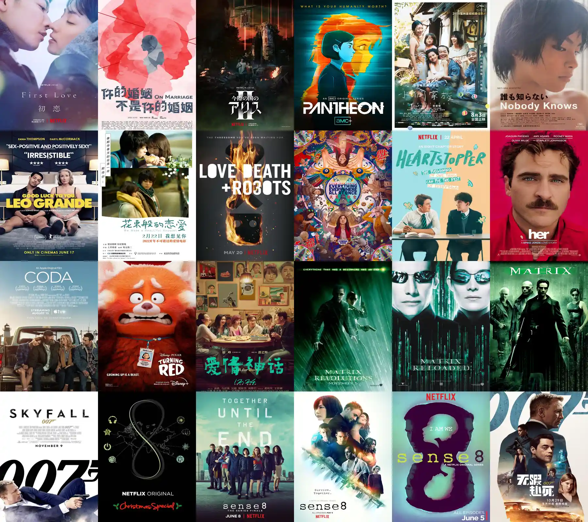

# Douban Image Grid


根据豆瓣标记了"读过"的书籍、"看过"的电影、"听过"的音乐，生成书籍封面墙、电影海报墙、音乐封面墙。

# 效果图



# 使用方法

```bash
git clone https://github.com/LGiki/douban-image-grid.git
cd douban-image-grid
pip install -r requirements.txt
python douban_image_grid.py --id=YOUR_DOUBAN_ID_HERE
```

执行完毕后可以到 `output` 目录中找到输出的封面墙图片，默认生成的是今年所看过的书籍的封面墙。

# 参数

执行 `python douban_image_grid.py --help` 可以查看全部支持的参数。

| 参数            | 默认值                                                       | 说明                                                         |
| --------------- | ------------------------------------------------------------ | ------------------------------------------------------------ |
| --id            |                                                              | 你的豆瓣ID，**必填**                                         |
| --mode          | `book`                                                       | 要生成的图片类型，该参数可以是：`book`、`movie`或`music`，分别表示图书封面墙、电影海报墙和音乐封面墙 |
| --year          | 当前年份                                                     | 要生成的年份，例如要生成 2022 年看/听过的书/电影/音乐，只需将该项设置为 `2022` 即可<br />如果将该项设置为`all`，则会读取账号所有的已读/已看/已听 |
| --width         | 600                                                          | 小图的宽度，单位：px                                         |
| --height        | 800                                                          | 小图的高度，单位：px<br />当 `mode` 参数设置为 `music` 时，将忽略该参数，并将其设置为和 `width` 相等 |
| --column        | 7                                                            | 大图的列数                                                   |
| --user_agent    | `Mozilla/5.0 (Windows NT 10.0; Win64; x64) AppleWebKit/537.36 (KHTML, like Gecko) Chrome/108.0.0.0 Safari/537.36` | 发送请求时使用的 [User Agent](https://developer.mozilla.org/en-US/docs/Web/HTTP/Headers/User-Agent) |
| --cache_folder  | `cache`                                                      | 缓存图片的目录路径                                           |
| --cookie        |                                                              | 当程序出错时，可以指定该参数为豆瓣的 Cookie                  |
| --output_folder | `output`                                                     | 输出图片的目录路径                                           |

# 致谢

- [https://github.com/icue/DoubanImageWall](https://github.com/icue/DoubanImageWall)

# License

MIT License

